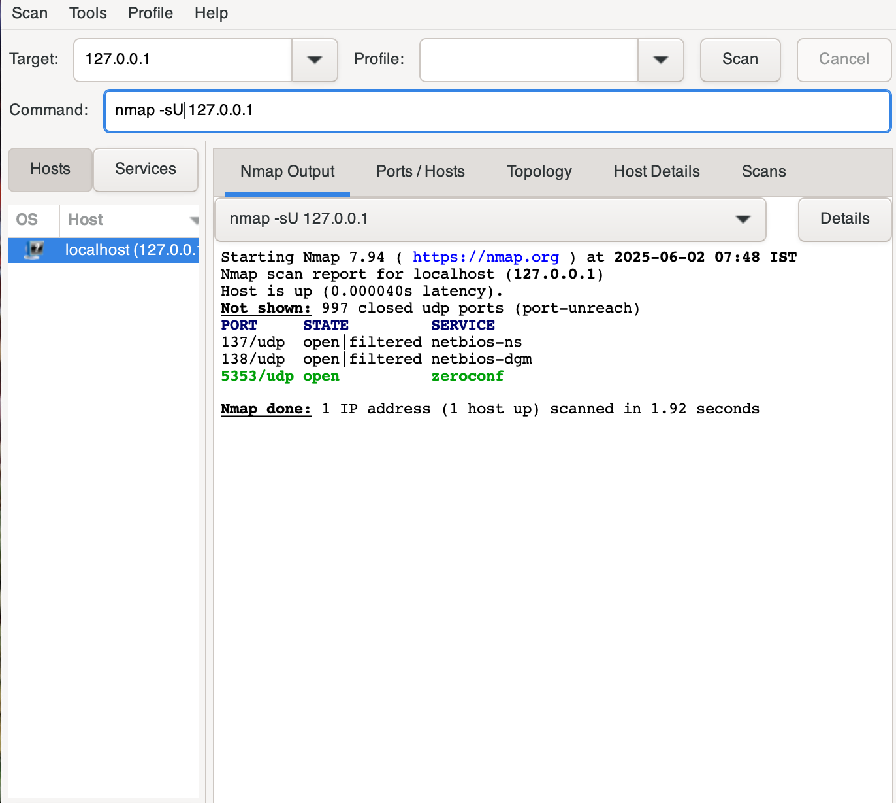
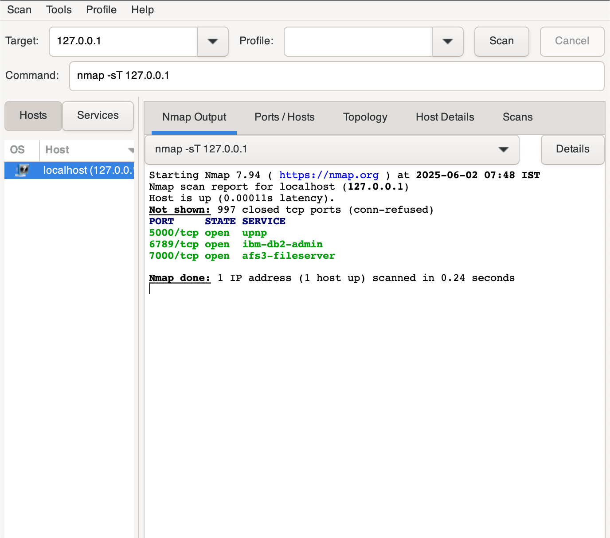
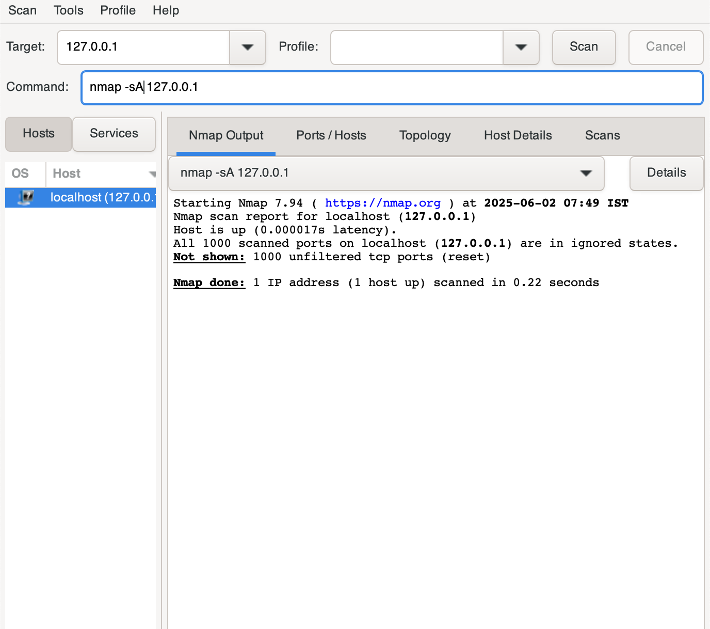
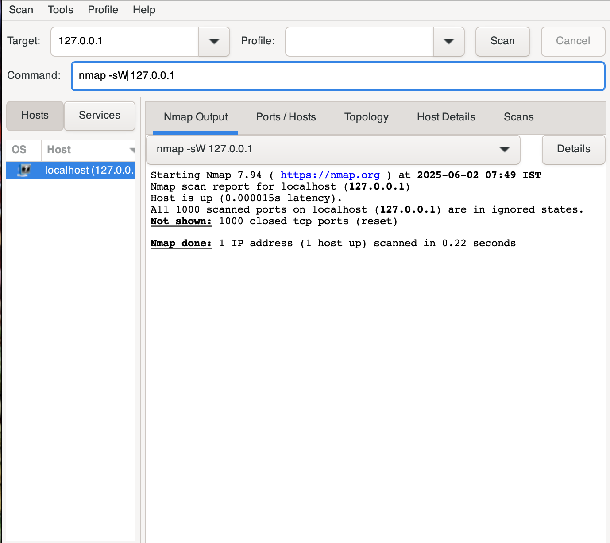
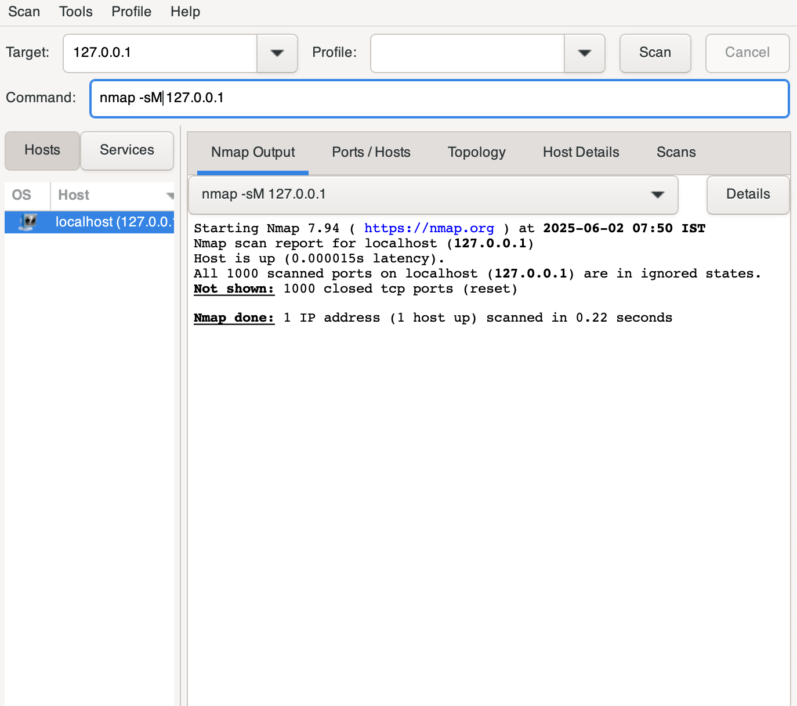
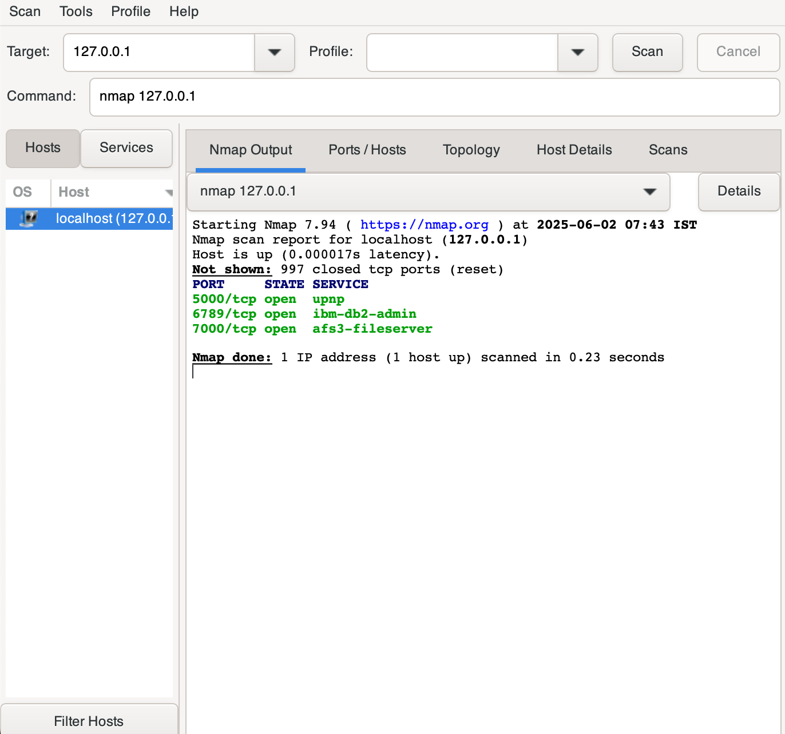
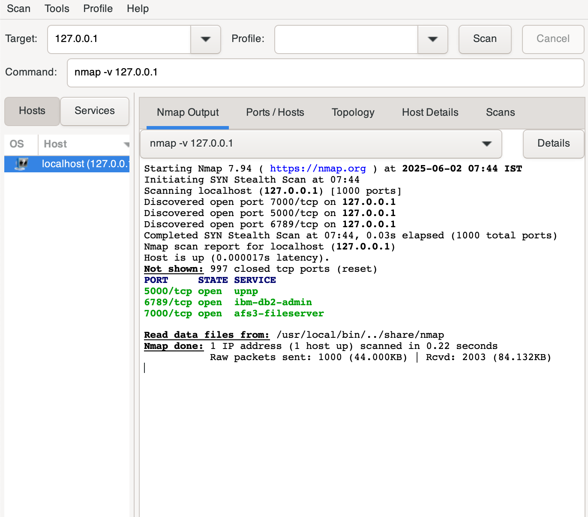
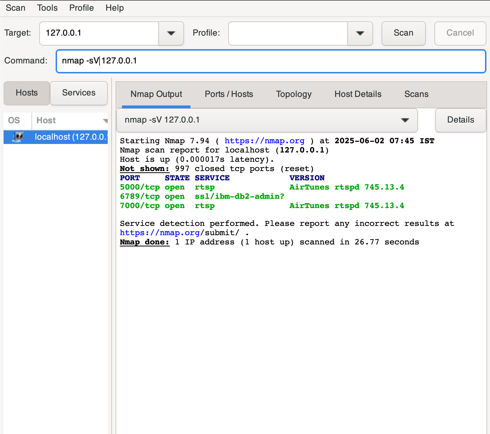
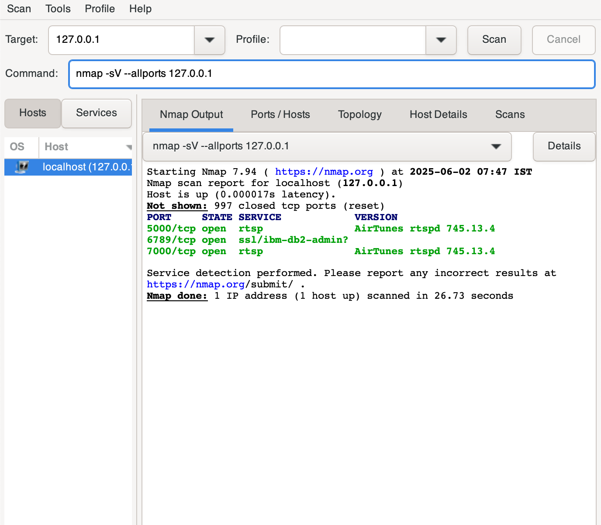

# Basic Network Scanning with Nmap

## Objective
To perform multiple types of scans using **Nmap** on a localhost target (`127.0.0.1`) to identify open ports, services, and analyze network exposure.

---

## Tools & Environment
- **Nmap v7.94**
- **Kali Linux / Parrot OS**
- Target: `127.0.0.1` (localhost)

---

## Commands Executed

## Nmap Scan Commands Used

| Command                         | Description                                                                 |
|---------------------------------|-----------------------------------------------------------------------------|
| `nmap -sU 127.0.0.1`            | UDP Scan — checks for open UDP ports                                        |
| `nmap -sT 127.0.0.1`            | TCP Connect Scan — default, full TCP 3-way handshake                       |
| `nmap -sA 127.0.0.1`            | ACK Scan — used to map firewall rules and detect filtered ports            |
| `nmap -sW 127.0.0.1`            | Window Scan — a stealth scan that analyzes TCP window size                 |
| `nmap -sM 127.0.0.1`            | Maimon Scan — stealth scan technique rarely used but good for firewall evasion |
| `nmap 127.0.0.1`                | Basic TCP Scan — quick default scan                                        |
| `nmap -v 127.0.0.1`             | Verbose Scan — same as above but with progress and more output             |
| `nmap -sV 127.0.0.1`            | Version Detection — detects software version running on open ports        |
| `nmap -sV --allports 127.0.0.1` | Version detection across all 65,535 TCP ports                              |

---

## Key Findings

### TCP Ports
- **5000/tcp**: RTSP service (AirTunes)
- **6789/tcp**: IBM DB2 Admin (ssl/possibly secure)
- **7000/tcp**: RTSP service (AirTunes)

### UDP Ports
- **5353/udp**: mDNS/Zeroconf
- **137,138/udp**: NetBIOS-related (open|filtered)

### Unusual/Filtered Results
- ACK, Window, Maimon scans returned no useful data (likely due to localhost firewall rules).

---

## Interpretation
- **RTSP** services often relate to media streaming. Should be restricted or monitored.
- **DB2 admin port** (6789) should not be open unless required and secured with strong authentication.
- **mDNS** and **NetBIOS** on UDP may allow local network discovery, which could be risky.

---

## Screenshots

All screenshots of the scans are in the `screenshots/` folder:

| File Name           | Matches Command       |
| ------------------- | --------------------- |
| `udp_scan.png`      | `nmap -sU`            |
| `tcp_scan.png`      | `nmap -sT`            |
| `ack_scan.png`      | `nmap -sA`            |
| `window_scan.png`   | `nmap -sW`            |
| `maimon_scan.png`   | `nmap -sM`            |
| `basic_scan.png`    | `nmap`                |
| `verbose_scan.png`  | `nmap -v`             |
| `version_scan.png`  | `nmap -sV`            |
| `allports_scan.png` | `nmap -sV --allports` |

## Screenshots

### UDP Scan

### TCP Connect Scan

### ACK Scan

### Window Scan

### Maimon Scan

### Basic Scan

### Verbose Scan

### Version Detection

### All Ports Version Detection

---

## Conclusion

This task demonstrates the use of various Nmap scan types to probe and analyze the open ports and services of a local host. Understanding the tools and methods attackers might use allows defenders to better secure their networks.

---

## References
- [Nmap Official Guide](https://nmap.org/book/)
- [Nmap Cheat Sheet](https://github.com/cheatsheetseries/cheatsheets/Nmap_Cheat_Sheet.md)
- [Explaining Nmap Scan Types](https://nmap.org/docs.html)
